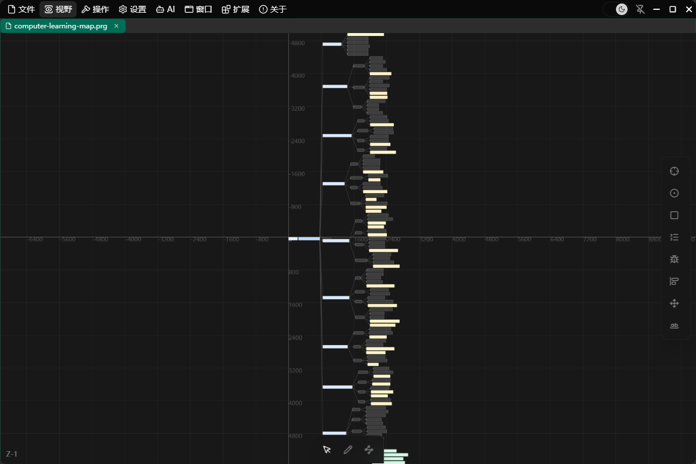

# Computer knowledge and skills learning map

A real Project Graph artifact created with Codex and the companion runtime, inspired by [Build Your Own X](https://github.com/codecrafters-io/build-your-own-x).

[Download the editable PRG](computer-learning-map.prg) · [Read the node outline](outline.md)

The overview shows structure; open the PRG and zoom in to read individual nodes.

- 152 text nodes and 151 directed edges; all nodes reachable from one root.
- 9 main learning branches, 30 highlighted BYOX practice projects, and 4 capstone routes.
- Chinese explanations with English computing terminology.

## Open it

After installing the bridge, open a **working copy** of this PRG through the companion desktop's File menu. To expose it to Codex, add that copy to your private configuration under an alias such as `learning-map`, including its directory in `allowedRoots`.

Example request: “Inspect learning-map. Find the database branch, explain its learning order, and propose a small implementation project.”

## What this demonstrates

The original workflow used the official CLI's `generate_node_tree_by_text`, styling tools, snapshots and desktop save/reopen. It is an advanced runtime example: bulk tree generation is not one of the bridge's seven public MCP tools. Those tools can inspect and incrementally edit an open copy.

The map extends the referenced project's learn-by-building approach with an original learning hierarchy. It does not reproduce tutorial bodies and is not an official CodeCrafters curriculum. Connections primarily organize learning topics; they are not a formally validated prerequisite graph.

The public copy was opened in the production companion and read through the official CLI: 152 TextNodes and 151 LineEdges. The original conversation, filesystem paths and raw diagnostic logs are not included.

**Known upstream limitation:** the pinned CLI cannot load some closed graphs containing manually sized text nodes (`TOOL_EXECUTION_FAILED`). This example must be open in the companion for inspection. This does not affect the editable PRG in the desktop. See [compatibility](../../docs/COMPATIBILITY.md).

This example's original graph/outline and screenshots are distributed under this repository's GPL-3.0-only license. Build Your Own X and linked tutorials retain their owners' rights.
